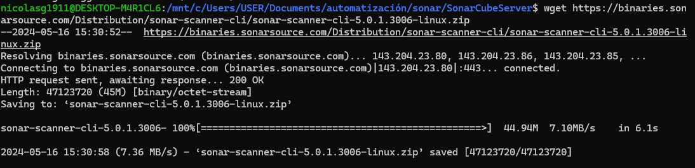

# SonarQube


## Implementacion

Se despliega SonarQube desde un archivo .yml con docker compose y así se ejecuta tanto el servicio de SonarQube como la base de datos que se necesita para este.<br>
Se utiliza el siguiente docker-compose.yml:
```
version: '2'

services:
  sonarqube:
    image: sonarqube
    ports:
      - "9000:9000"
    networks:
      - sonarnet
    environment:
      - SONARQUBE_JDBC_URL=jdbc:postgresql://db:5432/sonar
      - SONARQUBE_JDBC_USERNAME=sonar
      - SONARQUBE_JDBC_PASSWORD=sonar
    volumes:
      - sonarqube_conf:/opt/sonarqube/conf
      - sonarqube_data:/opt/sonarqube/data
      - sonarqube_extensions:/opt/sonarqube/extensions
      - sonarqube_bundled-plugins:/opt/sonarqube/lib/bundled-plugins

  db:
    image: postgres
    networks:
      - sonarnet
    environment:
      - POSTGRES_USER=sonar
      - POSTGRES_PASSWORD=sonar
    volumes:
      - postgresql:/var/lib/postgresql
      - postgresql_data:/var/lib/postgresql/data

networks:
  sonarnet:
    driver: bridge

volumes:
  sonarqube_conf:
  sonarqube_data:
  sonarqube_extensions:
  sonarqube_bundled-plugins:
  postgresql:
  postgresql_data:

```
Al ejecutar el comando ```docker-compose up``` se observa el contenedor corriendo
<br>

Posteriormente, se ingresa al servicio de sonarqube mediante la url localhost:9000 utilizando ``admin`` como usuario y contraseña
<br>
Antes de continuar, se deben cambiar las credenciales de la plataforma:
<br>
En este caso, se creará un proyecto local, aunque la fuente del proyecto puede provenir de diversas fuentes y se definen los datos del proyecto
<br>
Luego se escoge el método de análisis para el proyecto
<br>
Ahora se genera el token de autenticación para el análisis del proyecto
<br>
Habiendo hecho esto, ya tenemos el código para correr el análisis
<br>
Para ejecutar el código del análisis en nuestro proyecto, primero debemos instalar sonar-scanner en linux
<br>
Luego descargar y descomprimir la carpeta con la version de sonar
<br>
<br>
Ahora se mueven los archivos a opt/sonar-scanner
<br>
Se activa el scanner del proyecto
<br>
<br>
<br>
También podemos revisar las recomendaciones de sonnarqube
<br>